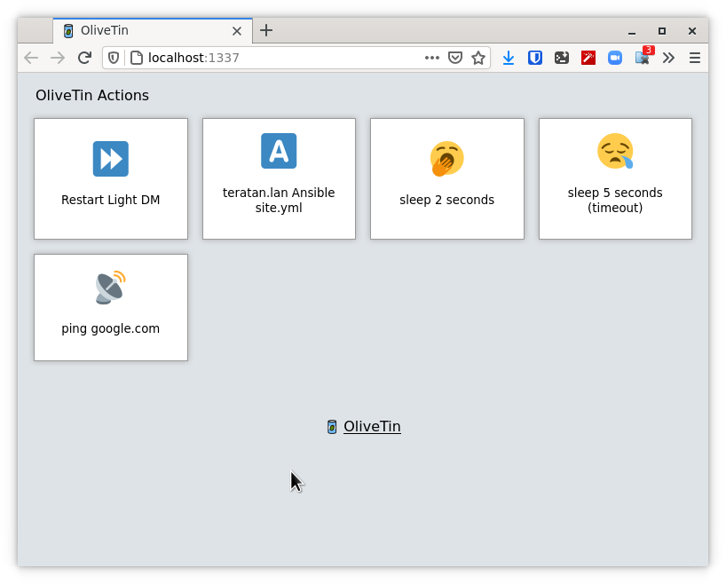
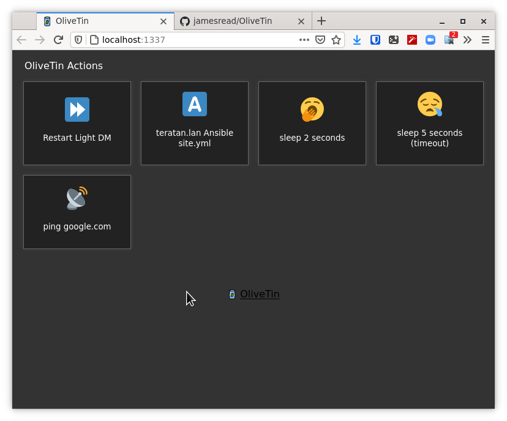
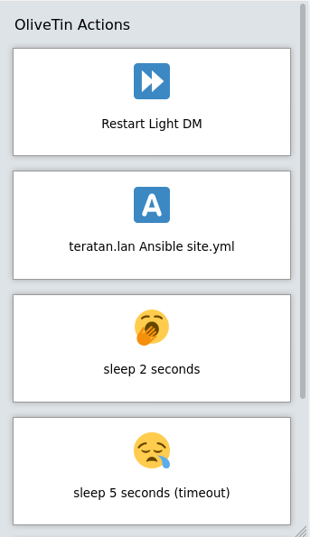

# OliveTin

OliveTin is a web based quick access control panel for running jobs.

For example, it can be used to turn home automation lights on or off, or start
workflows in n8n.  

## Video demo

TODO

## Screenshots

Desktop web browser;



Desktop web browser (dark mode); 



Mobile screen size (responsive layout); 



## `config.yaml` example

Put this `config.yaml` in `/etc/OliveTin/` if you're running a standard service, or mount it at `/config` if running in a container.

```yaml
listenAddressWebUI: 0.0.0.0:1337 # Listen on all addresses available, port 1337
logLevel: "INFO"
actions: 
- title: Restart Plex
  icon: smile
  shell: docker restart plex
  
  # This will send 1 ping 
- title: Ping Google.com
  shell: ping google.com -c 1
  
  # Restart lightdm on host "overseer"
- title: restart lightdm
  icon: poop
  shell: ssh root@overseer 'service lightdm restart'
```

## Ports 

By default OliveTin will use the following ports;

* `1337` - for hosting the web interface
* `1338` - for the REST API (the api the web interface uses to do stuff)
* `1339` - a modern gRPC API (OliveTin uses protobuf under the hood) 

Some people might not want the gRPC API public - simply set `listenAddressGrpcActions: 127.0.0.1:1339` in your config so it doesn't listen publicly. It cannot be disabled completely - it's required for the REST API to work though.

## Installation - systemd service (recommended)

Running OliveTin as a systemd service on a Linux machine is a bit more effort than running as a container - but it means it can use any program installed on your machine (you don't have to add programs to a container). 

1. Copy the `OliveTin` binary to `/usr/sbin/OliveTin`
2. Copy the `webui` directory contents to `/var/www/olivetin/` (eg, `/var/www/olivetin/index.html`)
3. Copy the `OliveTin.service` file to `/etc/systemd/system/`
4. Create a `config.yaml` using the example provided above to get you started.

Run `systemctl restart OliveTin` and check `systemctl status OliveTin`.

## Installation - as a container 

Of course, running a container image is very straightforward - but you might need to add files and programs to the OliveTin container to make it useful for your use case. Generally running a systemd service is better for OliveTin. 

### Running - `podman` (or `docker`)

```
root@host: podman create --name olivetin -p 1337 -p 1338 -p 1339 -v /etc/olivetin/:/config:ro olivetin

```

### Building - `buildah` (or `docker build`)

```
root@host: buildah bud -t olivetin
```

