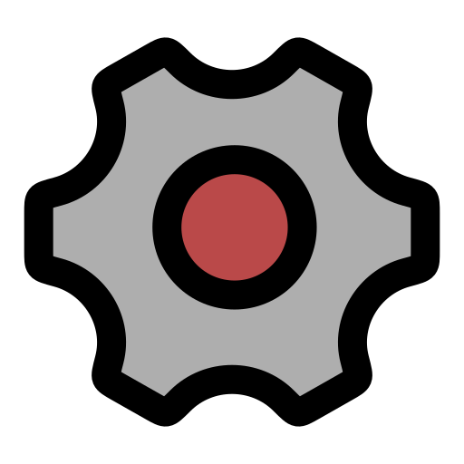
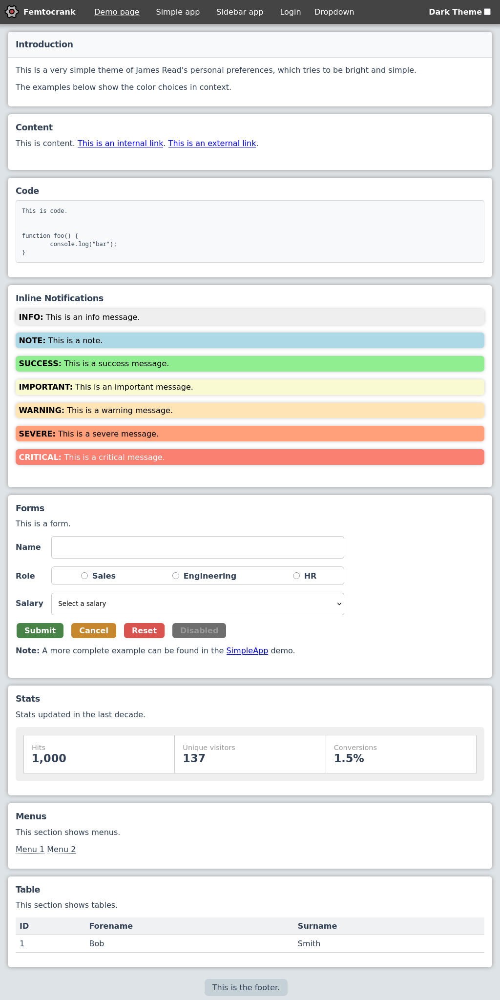
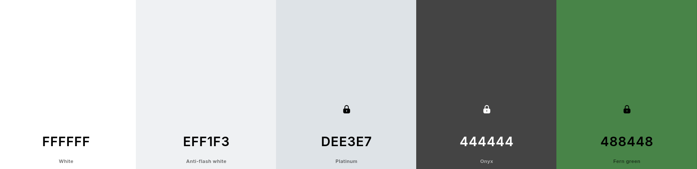

  
  <h1>FemtoCrank</h1>

  CSS theme for high accessibility and zero dependencies

  
  

A simple CSS theme with high accessibility and zero dependencies.

* **NPM:** https://www.npmjs.com/package/femtocrank
* **Blog post:** [Why do I use the same colors for everything?](https://blog.jread.com/posts/why-do-i-use-dee3e7/)

## Color Scheme

