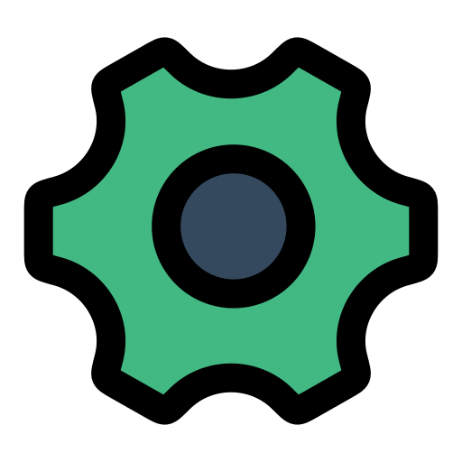

  
  <h1>PicoCrank</h1>

  A set of zero dependency Vue components built on the [FemtoCrank](https://github.com/jamesread/femtocrank) global CSS theme.

  
  

* npm: https://www.npmjs.com/package/picocrank
